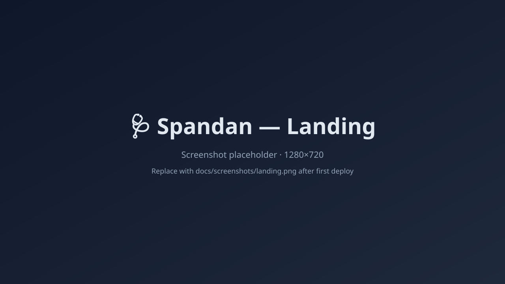
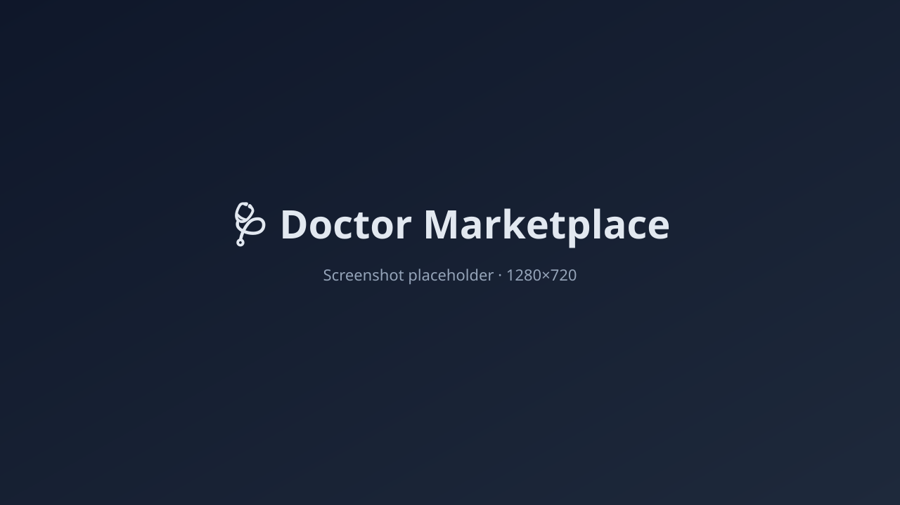
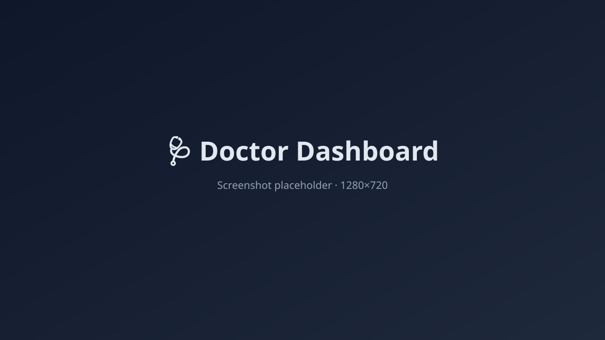
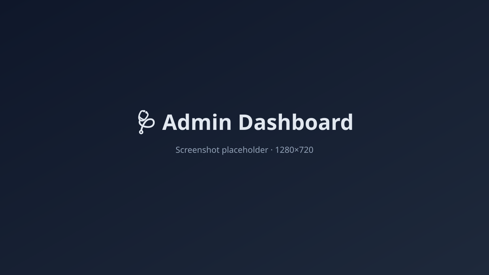
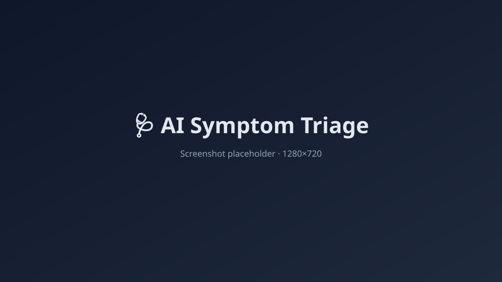
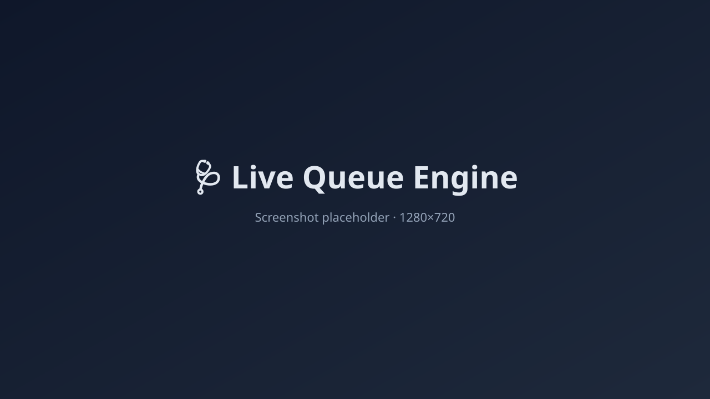
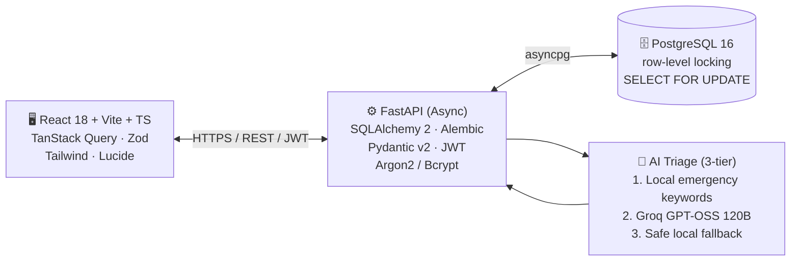

<div align="center">

# 🩺 Spandan

### AI-Assisted Appointment Booking & Private Chamber Management System — verified doctors, multi-chamber scheduling, real-time queues, and safety-first AI triage for Bangladesh.

[](https://spandan.cuetinsights.dev)
[](./LICENSE)
[](https://react.dev)
[](https://www.typescriptlang.org)
[](https://vite.dev)
[](https://fastapi.tiangolo.com)
[](https://www.postgresql.org)
[](https://tailwindcss.com)
[](https://groq.com)
[](./docker-compose.yml)

<br />

Spandan is a production-style healthcare platform that brings **patients, doctors, assistants, and admins** into one secure system — with AI-assisted symptom triage, role-based dashboards, and an end-to-end queue engine with no double-booking.

[🚀 Live Demo](https://spandan.cuetinsights.dev) · [🐛 Report Bug](https://github.com/sakawatkabir13/spandan/issues) · [✨ Request Feature](https://github.com/sakawatkabir13/spandan/issues)

</div>

---

## ✨ Why Spandan?

Booking a private chamber consultation in Bangladesh today means phone calls, paper registers, and zero visibility into queue times. **Spandan** digitises the entire flow — from **verified doctor profiles** and **multi-chamber scheduling** to a **real-time queue engine** with atomic serial allocation — and adds a **safety-first AI triage** layer that suggests which specialty to consult based on symptoms.

> ⚠️ **Spandan's AI is informational only.** It does **not** diagnose, prescribe, or replace professional medical advice. In an emergency, call **999** (Bangladesh).

---

## 📑 Table of Contents

1. [✨ Features](#-features)
2. [🖼️ Screenshots](#-screenshots)
3. [🧱 Tech Stack](#-tech-stack)
4. [🏗️ Architecture](#-architecture)
5. [🚀 Quick Start](#-quick-start)
6. [🔑 Demo Credentials](#-demo-credentials)
7. [🧪 Available Scripts](#-available-scripts)
8. [📁 Project Structure](#-project-structure)
9. [🔐 Environment Variables](#-environment-variables)
10. [🐳 Docker Deployment](#-docker-deployment)
11. [🛡️ Medical Disclaimer](#-medical-disclaimer)
12. [🗺️ Roadmap](#-roadmap)
13. [🤝 Contributing](#-contributing)
14. [🛡️ Security](#-security)
15. [📄 License](#-license)
16. [🙏 Acknowledgements](#-acknowledgements)
17. [👥 Contributors](#-contributors)

---

## ✨ Features

### 🧑‍⚕️ For Patients
- 🩺 Browse a verified directory of doctors with specialty and chamber filters
- 📅 Book appointments online with **live queue serial** allocation
- ✅ Confirm or cancel appointments and view doctor profile photos
- 🧾 Full **appointment history** with per-visit status tracking
- 🤖 **AI symptom triage** that recommends which specialty to consult
- 📱 Fully responsive across desktop, tablet, and mobile

### 👨‍⚕️ For Doctors
- 🧑‍💼 Dedicated **Doctor Dashboard** for schedules, chambers, and patient queue
- ➕ Create individual or recurring schedules with overlap protection
- 📈 Track today's queue, active serials, and consultation history
- 🏥 Manage **multiple chambers** with independent schedules and fees

### 🧑‍💼 For Assistants
- 🎟️ Manage the **walk-in (offline) queue** for the assigned doctor/chamber
- ➡️ Mark serials as *served*, *skipped*, or *delayed* in real time
- 🔄 Move patients through check-in, waiting, skipped, in-room, completed, and no-show states

### 🛡️ For Admins
- 🧭 Centralized **Admin Dashboard** for moderation
- ✅ Approve or reject doctor verification
- 👀 Manage user access and inspect protected audit logs

### 🔐 Platform-Wide
- 🔑 Email + password auth with **JWT access + refresh tokens** and **Argon2/Bcrypt** hashing
- 🔁 Logout and password changes revoke existing access and refresh tokens
- 🏭 Separate development and production Docker stacks with health checks
- 🧪 Backend tests with **Pytest** + frontend tests with **Vitest** + **Testing Library**
- 🎨 Theming and design tokens with **Tailwind CSS**
- 🔒 Strict Postgres constraints and row-level locking (`SELECT FOR UPDATE`) — zero double-booking

---

## 🖼️ Screenshots

> Placeholders ship as `.svg` files in `docs/screenshots/`. Replace with real `.png` (1280×720) screenshots after the first deploy.

| Landing | Marketplace |
| :---: | :---: |
|  |  |

| Doctor Dashboard | Admin Dashboard |
| :---: | :---: |
|  |  |

| AI Triage | Live Queue |
| :---: | :---: |
|  |  |

---

## 🏗️ Architecture



**Key flows**
- **Auth & RBAC** — JWT access + refresh tokens; Argon2/Bcrypt hashing; four role-based portals (Patient, Doctor, Assistant, Admin).
- **Queue engine** — PostgreSQL row-level locking (`SELECT FOR UPDATE`) guarantees **no double-booking** between online and walk-in serials.
- **AI triage** — local emergency keyword screening → Groq `openai/gpt-oss-120b` strict structured output → safe fallback when the provider is unavailable.
- **Doctor verification** — doctors only become publicly visible after admin approval (`PENDING → APPROVED / REJECTED / SUSPENDED`).

See [`AI_TRIAGE_GUIDE.md`](./AI_TRIAGE_GUIDE.md) for the full triage pipeline. For deeper internals — auth flow, queue-engine locking, state machines, ERD, and deployment topology — see [`docs/ARCHITECTURE.md`](./docs/ARCHITECTURE.md).

---

## 🧱 Tech Stack

### Frontend
| Layer | Technology |
| --- | --- |
| Framework | **React 18** |
| Language | **TypeScript 5** |
| Build tool | **Vite 8** |
| Styling | **Tailwind CSS 3** |
| Routing | **React Router 7** |
| Forms | **React Hook Form** + **Zod** resolvers |
| Data fetching | **TanStack Query v5** |
| Icons | **Lucide React** |

### Backend
| Layer | Technology |
| --- | --- |
| Runtime | **Python 3.11+** |
| Framework | **FastAPI 0.110** (async) |
| ORM | **SQLAlchemy 2** with `asyncpg` |
| Validation | **Pydantic v2** |
| Migrations | **Alembic** |
| Auth | **JWT** (access + refresh) · **Argon2 / Bcrypt** hashing |
| AI | **Groq API** — `openai/gpt-oss-120b` |

### Database & Tooling
| Layer | Technology |
| --- | --- |
| Database | **PostgreSQL 16** (row-level locking) |
| Backend tests | **Pytest** + `pytest-asyncio` + `aiosqlite` |
| Backend lint | **Ruff** |
| Frontend tests | **Vitest** + **Testing Library** + **jsdom** |
| Frontend checks | **TypeScript (`tsc --noEmit`)** |
| Orchestration | **Docker Compose** (db + backend + frontend) |

---

---

## 🚀 Quick Start

### Prerequisites

- **Docker** & Docker Compose **v2.x+**
- `make` *(optional, for convenience targets)*

### 1. Clone the repository

```bash
git clone https://github.com/sakawatkabir13/spandan.git
cd spandan
```

### 2. Configure environment

```bash
cp .env.example .env
```

> 🔑 *(Optional)* add a real `GROQ_API_KEY` to `.env` to enable live AI triage. Without it, Spandan automatically runs the **local fallback engine**.

### 3. Launch the stack

```bash
make up
# or:  docker compose up --build -d
```

On first boot the backend will:

1. Wait for Postgres to be healthy.
2. Run `alembic upgrade head` (idempotent migrations).
3. Execute `python -m scripts.seed` (idempotent seed data).
4. Start Uvicorn with hot-reload.

### 4. Open the apps

| App | URL |
| --- | --- |
| 🖥️ Frontend | http://localhost:5173 |
| 📘 Swagger UI | http://localhost:8000/docs |
| 📕 ReDoc | http://localhost:8000/redoc |
| 🌐 Production | https://spandan.cuetinsights.dev |

---

## 🔑 Demo Credentials

> All seed accounts use the password **`Password123!`**. **Change these immediately in any non-local environment.**

| Role | Email | Status | Notes |
| --- | --- | --- | --- |
| Administrator | `admin@spandan.com.bd` | Active | Full system access & verification review |
| Doctor (Approved) | `dr.rahman@spandan.com.bd` | Approved | Cardiologist & General Medicine (Dhanmondi) |
| Doctor (Approved) | `dr.farhana@spandan.com.bd` | Approved | Pediatrician (Uttara) |
| Doctor (Pending) | `dr.tariq@spandan.com.bd` | Pending | Awaiting admin verification |
| Assistant | `assistant.karim@spandan.com.bd` | Active | Assigned to Dr. Rahman |
| Assistant | `assistant.nasrin@spandan.com.bd` | Active | Assigned to Dr. Farhana |
| Patient | `patient.jamal@gmail.com` | Active | Sample patient with bookings |
| Patient | `patient.sadia@gmail.com` | Active | Sample patient with AI recommendation logs |

---

## 🧪 Available Scripts

### Root (`Makefile` shortcuts)

| Command | Description |
| --- | --- |
| `make up` | Start all services (db, backend, frontend) via Docker Compose |
| `make down` | Stop and remove containers |
| `make restart` | Restart all services |
| `make logs` | Follow logs from all services |
| `make migrate` | Run Alembic migrations inside the backend container |
| `make seed` | Re-run or reset the seed script |
| `make test` | Run the full Pytest backend suite |
| `make clean` | Remove volumes, containers, and build artifacts |

### Backend (inside `backend/`)

```bash
ruff check .              # lint
pytest -v                 # run tests
alembic upgrade head      # apply migrations
uvicorn app.main:app --reload
```

### Frontend (inside `frontend/`)

| Script | Description |
| --- | --- |
| `npm run dev` | Start the Vite dev server with HMR |
| `npm run build` | Production build to `dist/` |
| `npm run preview` | Preview the production build locally |
| `npm run lint` | Run TypeScript validation without emitting files |
| `npm run test` | Run the Vitest suite once |

---

## 📁 Project Structure

```
spandan/
├── backend/                 # FastAPI service
│   ├── app/
│   │   ├── api/             # routes & dependencies
│   │   │   ├── dependencies/
│   │   │   └── routes/
│   │   ├── core/            # config, security, exceptions
│   │   ├── db/              # SQLAlchemy base, async session
│   │   ├── models/          # ORM models
│   │   ├── repositories/    # data-access layer
│   │   ├── schemas/         # Pydantic DTOs
│   │   └── services/        # business logic
│   ├── alembic/             # migrations
│   ├── scripts/             # seed data
│   ├── tests/               # Pytest suite
│   ├── Dockerfile
│   └── pyproject.toml
├── frontend/                # Vite + React + TS
│   ├── src/
│   │   ├── api/             # axios client
│   │   ├── components/      # common, layout
│   │   ├── context/         # AuthContext
│   │   ├── pages/           # auth, dashboard, doctors, ai
│   │   └── types/
│   ├── tests/               # Vitest setup
│   ├── Dockerfile
│   └── package.json
├── .github/
│   ├── ISSUE_TEMPLATE/      # bug_report.yml, feature_request.yml
│   ├── workflows/ci.yml     # GitHub Actions CI
│   └── PULL_REQUEST_TEMPLATE.md
├── docker-compose.yml
├── Makefile
├── .env.example
├── LICENSE
├── CONTRIBUTING.md
├── CHANGELOG.md
├── SECURITY.md
├── CODE_OF_CONDUCT.md
├── AI_TRIAGE_GUIDE.md
├── docs/
│   ├── ARCHITECTURE.md
│   └── screenshots/
└── README.md
```

---

## 🔐 Environment Variables

All variables are loaded from `.env` via `pydantic-settings`. Server-side secrets **must never** be committed.

| Variable | Required | Description |
| --- | :---: | --- |
| `APP_ENV` | ✅ | `development` \| `staging` \| `production` |
| `APP_NAME` | ✅ | Service name (default: `Spandan`) |
| `APP_TIMEZONE` | ✅ | IANA timezone (default: `Asia/Dhaka`) |
| `DATABASE_URL` | ✅ | e.g. `postgresql+asyncpg://spandan:spandan@db:5432/spandan` |
| `JWT_SECRET_KEY` | ✅ | Long random string — **rotate in production** |
| `JWT_ALGORITHM` | ✅ | `HS256` (default) |
| `ACCESS_TOKEN_EXPIRE_MINUTES` | ✅ | Default `30` |
| `REFRESH_TOKEN_EXPIRE_DAYS` | ✅ | Default `7` |
| `FRONTEND_URL` | ✅ | e.g. `https://spandan.cuetinsights.dev` |
| `BACKEND_URL` | ✅ | e.g. `https://api.spandan.cuetinsights.dev` |
| `CORS_ORIGINS` | ✅ | Comma-separated allow-list |
| `GROQ_API_KEY` | ⚙️ | Enables live AI triage; fallback engine runs without it |
| `GROQ_MODEL` | ⚙️ | Default `openai/gpt-oss-120b` |
| `UPLOAD_DIR` | ✅ | Server-side upload path (default `uploads`) |
| `MAX_UPLOAD_SIZE_MB` | ✅ | Default `5` |
| `EMERGENCY_CONTACT_NUMBER` | ✅ | Default `999` |

---

## 🐳 Docker Deployment

`docker-compose.yml` runs the development/demo stack. `docker-compose.prod.yml` builds non-root production images, serves the frontend through Nginx, keeps the backend and database private, disables demo data and API documentation, and adds health checks and request limits.

```bash
# Build & start everything
docker compose up --build -d

# Follow logs
docker compose logs -f

# Run the backend test suite inside the container
docker compose exec backend pytest -v

# Apply migrations or re-seed
docker compose exec backend alembic upgrade head
docker compose exec backend python -m scripts.seed

# Tear down
docker compose down
```

A healthchecked Postgres ensures Alembic migrations only run after the DB is ready.

For a public deployment, create `.env.production` from `.env.production.example` and follow [`DEPLOYMENT.md`](./DEPLOYMENT.md). Uploaded profile photos currently use a Docker volume, so multi-host deployments need shared object storage.

### Completed workflows

Patients can discover approved doctors, view profile photos, book, confirm, or cancel appointments, edit their profile, and track live queue progress. Doctors can manage chambers, create individual or recurring schedules, control bookings, cancel sessions, edit professional details, and create assistants with individual permissions. Assistants can book registered patients and operate assigned queues. Administrators can verify doctors, control user access, and inspect recent audited activity.

Queue tracking refreshes every 15 seconds. Session times use `APP_TIMEZONE` (`Asia/Dhaka` by default). Sessions cannot overlap for the same doctor, booked session times cannot be changed without first cancelling bookings, and cancelled serial numbers are not reused.

---

## 🛡️ Medical Disclaimer

1. **Not a medical device.** Spandan's AI Specialist Recommendation tool provides **general guidance only** based on user-entered symptoms. It **never** diagnoses illnesses or prescribes medication.
2. **Emergencies.** If you or someone near you is experiencing life-threatening symptoms (e.g., severe chest pain, difficulty breathing, stroke symptoms, severe bleeding), call **999** immediately or visit the nearest hospital emergency department.
3. **Consult a licensed professional.** Always verify recommendations with a registered doctor before making health decisions.

---

## 🗺️ Roadmap

- [ ] SMS, WhatsApp, or email confirmations and reminders
- [ ] Patient rescheduling and a cancellation waitlist
- [ ] Payment, receipt, and refund integration
- [ ] Password reset, contact verification, and optional administrator MFA
- [ ] WebSocket or SSE live queue updates
- [ ] Doctor availability calendar view
- [ ] Patient PWA shell (install-to-home-screen, offline support)
- [ ] Telemedicine video call integration
- [ ] Internationalization (English · বাংলা)
- [ ] Analytics dashboard for chamber owners
- [ ] Standards-based clinical-system exchange where FHIR interoperability is required

The core booking and queue workflows do not require these external services. Payments, messaging, clinical-system exchange, and data-retention rules must be selected by the deploying organization. Spandan is an appointment and chamber-management system, not an electronic medical record.

Have an idea? [Open a feature request](https://github.com/sakawatkabir13/spandan/issues/new?template=feature_request.yml).

---

## 🤝 Contributing

We love contributions! Please read [`CONTRIBUTING.md`](./CONTRIBUTING.md) and follow the [Code of Conduct](./CODE_OF_CONDUCT.md). A starter PR template is provided and our CI runs lint + tests automatically.

---

## 🛡️ Security

Found a vulnerability? Please review [`SECURITY.md`](./SECURITY.md) and report it privately — **do not** open a public issue. We follow coordinated disclosure and will credit reporters with consent.

---

## 📄 License

This project is licensed under the **MIT License** — see the [`LICENSE`](./LICENSE) file for details.

© 2026 **Mohammad Sakawat Kabir**

---

## 🙏 Acknowledgements

- [FastAPI](https://fastapi.tiangolo.com/) & [SQLAlchemy](https://www.sqlalchemy.org/) — rock-solid async backend foundations.
- [Groq](https://groq.com/) — hosted inference for the configured GPT-OSS model.
- [TanStack](https://tanstack.com/), [Tailwind CSS](https://tailwindcss.com/), and the [Vite](https://vitejs.dev/) team — delightful frontend DX.
- [PostgreSQL](https://www.postgresql.org/) — the world's most advanced open-source database.
- The Bangladeshi doctor and patient community — this project exists to serve you.

---

## 👥 Contributors

<!-- ALL-CONTRIBUTORS-LIST:START -->
| Name | Role / Focus | GitHub |
| :--- | :--- | :---: |
| **Mohammad Sakawat Kabir** | Project lead & full-stack | [@sakawatkabir13](https://github.com/sakawatkabir13) |
| **Abdur Rashid Raj** | Frontend & patient flows | [@Asimpleman420](https://github.com/Asimpleman420) |
| **Olid Hussan Opu** | Auth, dashboards & admin flows | [@olid-opu](https://github.com/olid-opu) |
<!-- ALL-CONTRIBUTORS-LIST:END -->

If you'd like to join in, see the [Contributing guide](./CONTRIBUTING.md).

---

<div align="center">

⭐ **If you find this project useful, please consider giving it a star!** ⭐

Made with 💚 in 🇧🇩 Bangladesh by the [Spandan team](#-contributors)

</div>
