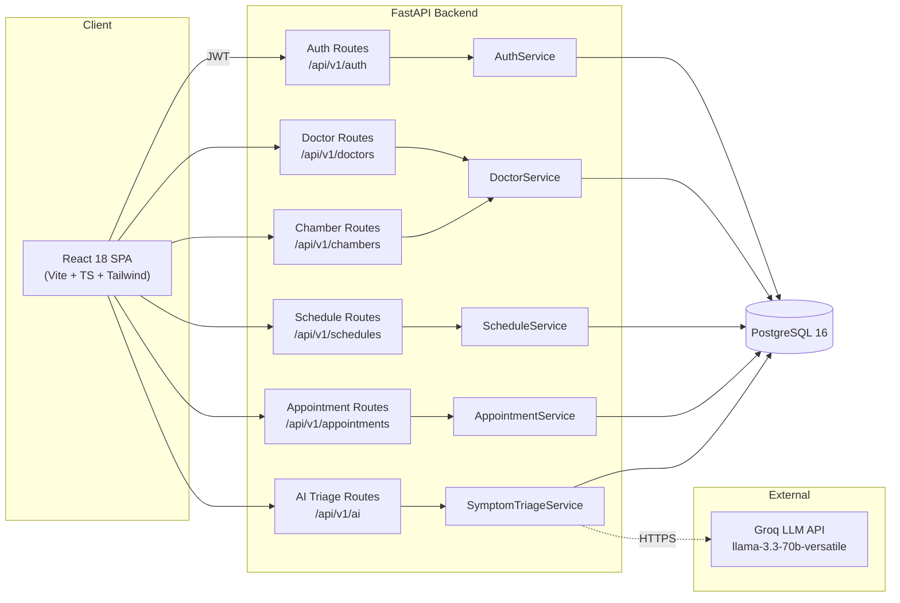
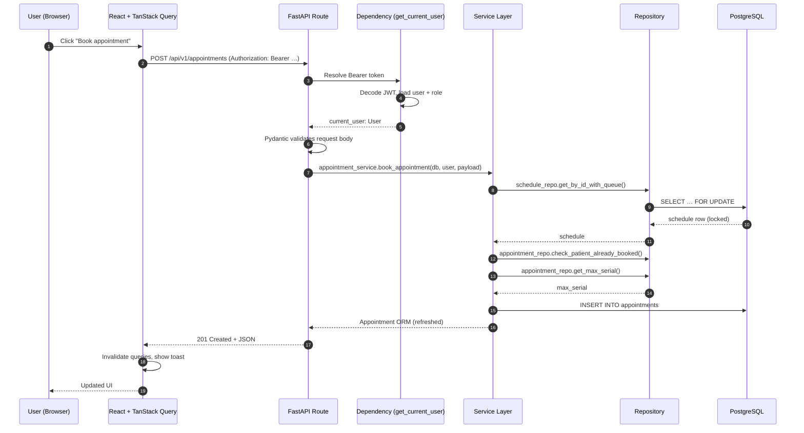
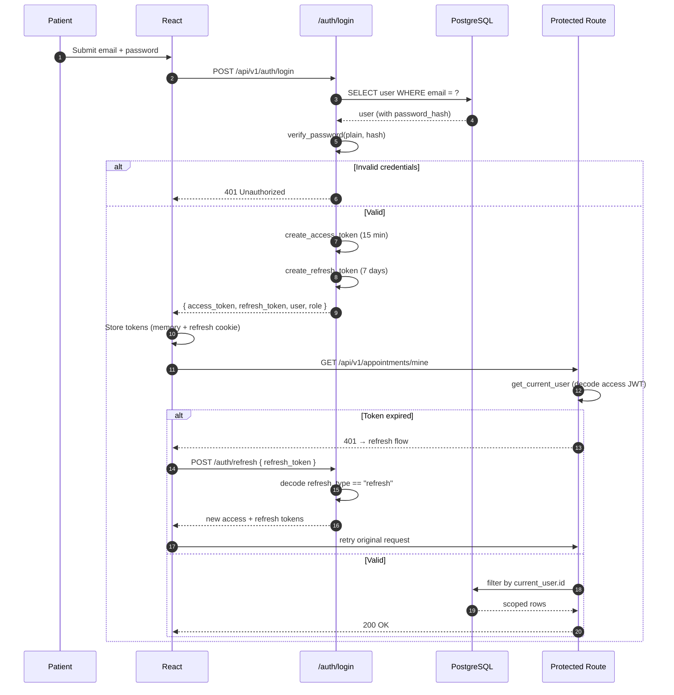
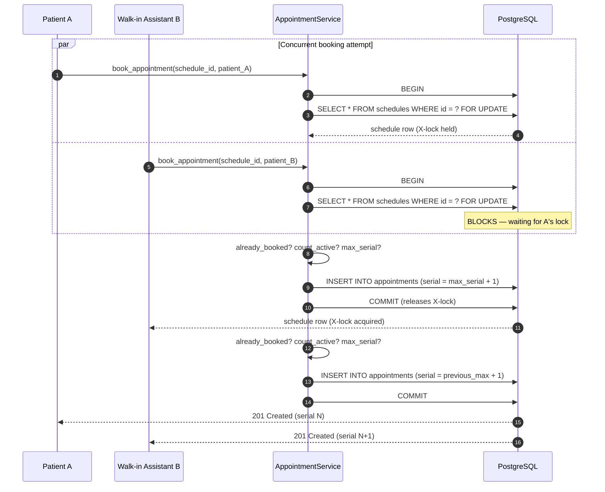
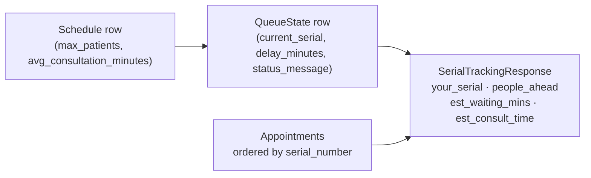
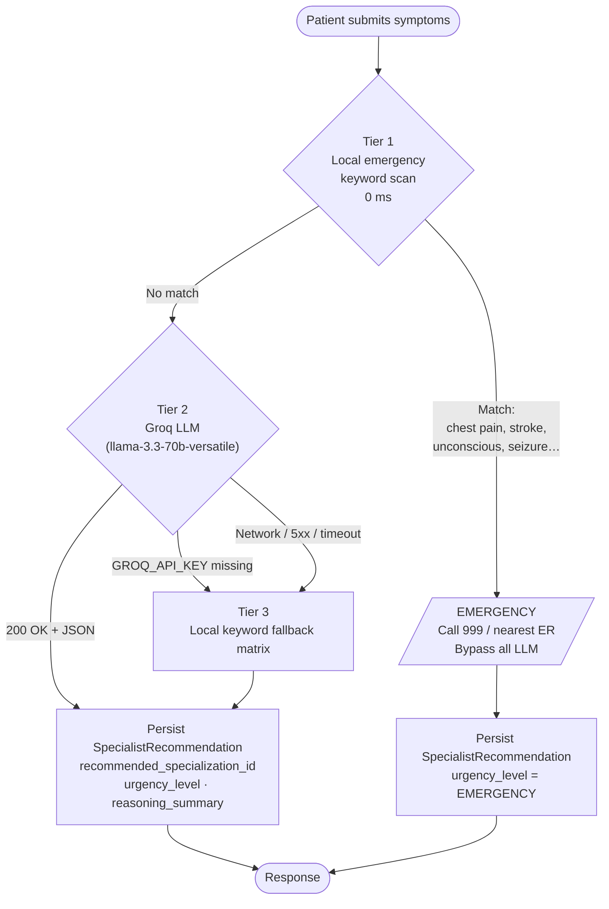
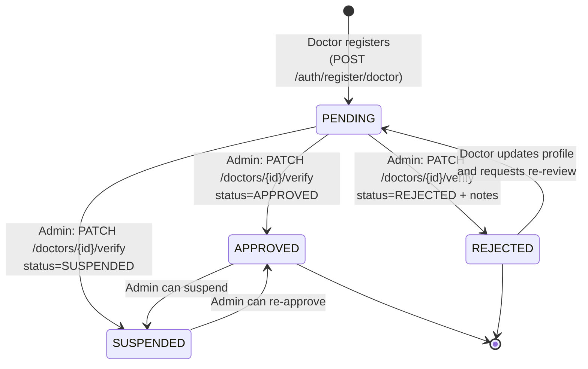
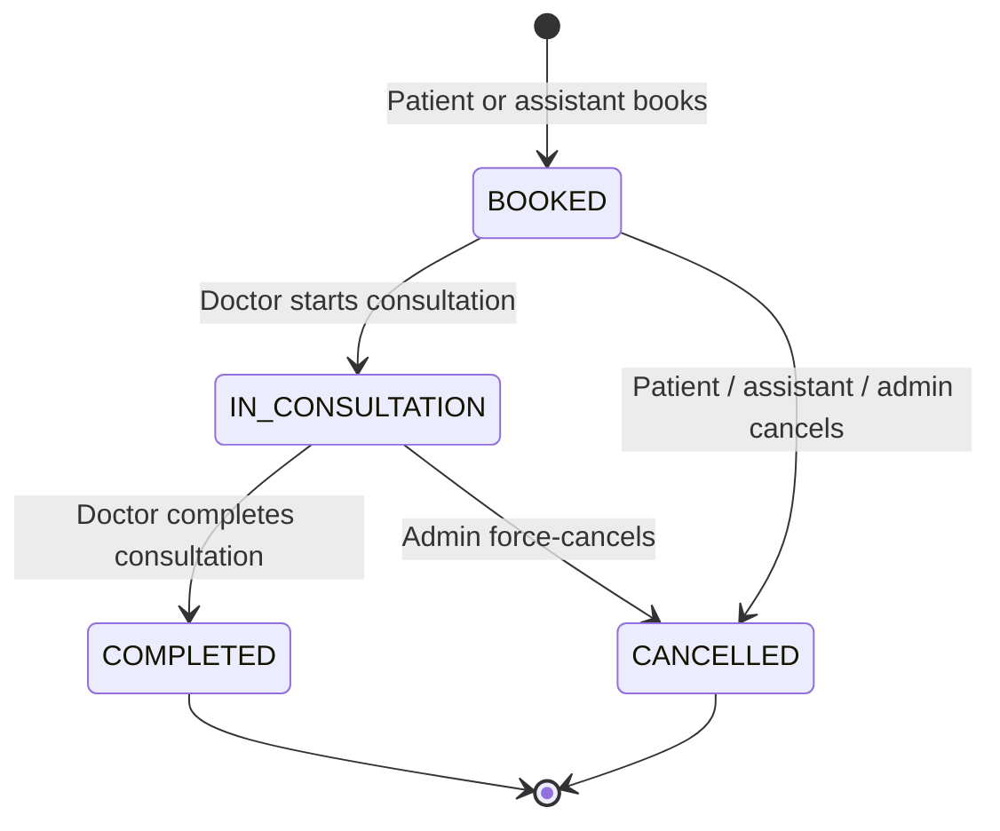
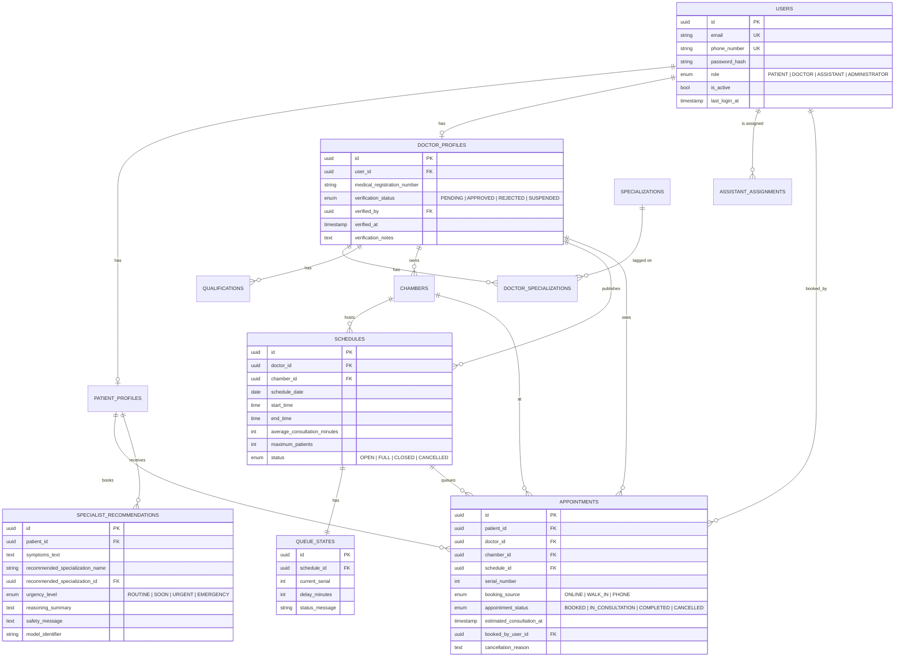
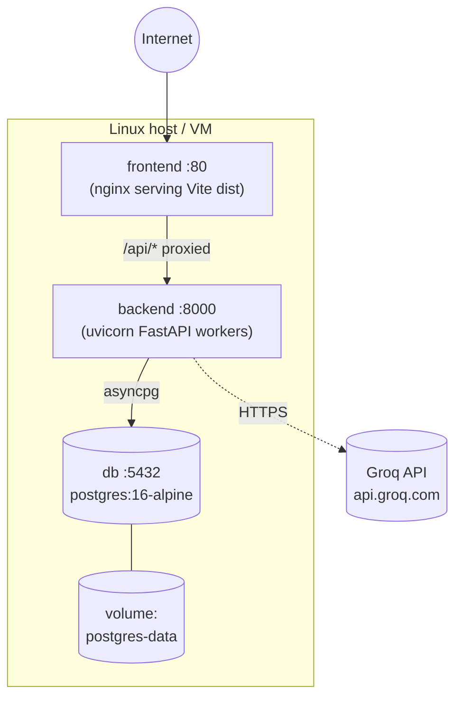

<div align="center">

# 🏛️ Spandan — System Architecture

### Internal design notes for engineers, contributors, and reviewers.

[](../backend)
[](../frontend)
[](https://www.postgresql.org)
[](https://groq.com)
[](#data-model)

</div>

---

## 📑 Table of Contents

1. [System Overview](#-system-overview)
2. [Layered Architecture](#-layered-architecture)
3. [Component Diagram](#-component-diagram)
4. [Request Lifecycle](#-request-lifecycle)
5. [Auth & RBAC Flow](#-auth--rbac-flow)
6. [Queue Engine (No-Double-Booking)](#-queue-engine-no-double-booking)
7. [AI Symptom Triage (3-Tier)](#-ai-symptom-triage-3-tier)
8. [Doctor Verification Lifecycle](#-doctor-verification-lifecycle)
9. [Appointment Booking State Machine](#-appointment-booking-state-machine)
10. [Data Model (ERD)](#-data-model-erd)
11. [Deployment Topology](#-deployment-topology)
12. [Security Boundaries](#-security-boundaries)
13. [Observability Hooks](#-observability-hooks)
14. [Glossary](#-glossary)

---

## 🏛️ System Overview

Spandan is a **single-tenant, role-aware healthcare operations platform** that connects four distinct user personas (Patients, Doctors, Assistants, Administrators) through a single FastAPI REST backend, a React 18 SPA, and a PostgreSQL 16 datastore.

The system has three primary responsibilities that drive its architecture:

| Responsibility                  | Architectural Mechanism                                        |
| ------------------------------- | -------------------------------------------------------------- |
| **Safe concurrency** for booking | PostgreSQL row-level locking (`SELECT FOR UPDATE`) + serial uniqueness per schedule |
| **Safety-first AI suggestions**  | 3-tier triage pipeline (local rule → Groq LLM → local fallback) |
| **Trust through verification**   | Explicit state machine `PENDING → APPROVED / REJECTED / SUSPENDED` on every doctor profile |

Everything else — role-based dashboards, multi-chamber scheduling, JWT auth, assistant delegation — exists to make those three guarantees usable from a browser.

---

## 🧱 Layered Architecture

```
┌────────────────────────────────────────────────────────────────────┐
│                          Browser (React 18)                         │
│  TanStack Query (cache + retry) · React Hook Form · Zod (client)   │
└────────────────────────────┬───────────────────────────────────────┘
                             │  HTTPS · Bearer JWT · JSON over REST
                             ▼
┌────────────────────────────────────────────────────────────────────┐
│                    FastAPI 0.110 (Async, Python 3.11)               │
│  ┌──────────────┐  ┌───────────────  ┌────────────────────────┐   │
│  │  API Routes  │  │ Dependencies │  │  Pydantic v2 Schemas   │   │
│  │ /auth/...    │  │ (auth, RBAC) │  │  (request/response)    │   │
│  └──────┬───────┘  └──────┬───────┘  └───────────┬────────────┘   │
│         └─────────────────┼────────────────────────────────────────────┘ │
│                           ▼                                         │
│  ┌──────────────────────────────────────────────────────────────┐  │
│  │                  Service Layer (business rules)              │  │
│  │   auth · doctor · chamber · schedule · appointment · ai      │  │
│  └──────────────────────────┬───────────────────────────────────┘  │
│                             ▼                                      │
│  ┌──────────────────────────────────────────────────────────────┐  │
│  │              Repository Layer (data access)                  │  │
│  │   Async SQLAlchemy 2 · asyncpg · selectinload · row locks    │  │
│  └──────────────────────────┬───────────────────────────────────┘  │
└─────────────────────────────┼──────────────────────────────────────┘
                              ▼
                ┌─────────────────────────────┐
                │   PostgreSQL 16             │
                │   row-level locking         │
                │   Alembic migrations        │
                └─────────────────────────────┘
```

**Rule of thumb for contributors:** routes are thin, services own business rules, repositories own SQL. Schemas are the *only* place types are declared.

---

## 🧩 Component Diagram



---

## 🔁 Request Lifecycle

Every authenticated request follows the same path:



Key invariants:

1. The DB session is request-scoped (`get_db()` dependency).
2. The `Schedule` row is locked **before** any serial allocation, so two concurrent bookings can never receive the same serial number.
3. Errors raise `SpandanException` → mapped to a structured JSON error by FastAPI's exception handler.

---

## 🔐 Auth & RBAC Flow

Spandan uses **dual-token JWT** (access + refresh) with Argon2/Bcrypt password hashing.



**Roles** (enum `UserRole`):

| Role            | Can read                       | Can write                                  |
| --------------- | ------------------------------ | ------------------------------------------ |
| `PATIENT`       | own appointments, public doctors | own appointments (cancel only)             |
| `DOCTOR`        | own schedule + appointments    | own profile, schedule, appointment status  |
| `ASSISTANT`     | assigned doctor's schedule     | walk-in bookings + status for that doctor   |
| `ADMINISTRATOR` | everything                     | doctor verification, all entities          |

Permission checks live in **services**, not routes, so a single business rule cannot be bypassed by a new endpoint.

---

## 🚦 Queue Engine (No-Double-Booking)

The queue engine guarantees two invariants that together eliminate the class of "double-booked serial" bugs:

1. **At most one active appointment per `(schedule_id, patient_id)`** — enforced in `AppointmentService.book_appointment()` via `check_patient_already_booked()`.
2. **Strictly monotonic serial numbers per `schedule_id`** — enforced inside a row-locked transaction on `Schedule`.



**Serial tracking** (`GET /api/v1/appointments/serial-tracking/{schedule_id}`):



When a doctor flips status to `IN_CONSULTATION`, `QueueState.current_serial` is auto-synced to that appointment's serial, and `status_message` updates accordingly.

---

## 🤖 AI Symptom Triage (3-Tier)

Safety is the design constraint: **never delay a critical case with a cloud round-trip**, and **never return a hard error** if the LLM is unavailable.



**Tier 1 keyword list** (15 terms — see [`backend/app/services/ai.py`](../backend/app/services/ai.py) `EMERGENCY_KEYWORDS`):

```
chest pain · severe breathing difficulty · shortness of breath severe
stroke · slurred speech · sudden weakness · unconscious · fainting
severe bleeding · heart attack · coughing blood · blue lips · seizure
unresponsive · anaphylaxis
```

**Tier 2 prompt contract** (strict JSON, no markdown):

```json
{
  "recommended_specialization_name": "Cardiology",
  "alternative_specialization_name": "General Medicine",
  "urgency_level": "soon",
  "reasoning_summary": "…",
  "safety_message": "…"
}
```

The LLM is given the **live list of active `Specialization` rows** from the DB, so its recommendation always matches a bookable specialty in the system.

**Tier 3 fallback** routes by organ-system keyword counts (`heart`/`palpitation` → Cardiology, `bone`/`joint` → Orthopedics, etc.) and defaults to **General Medicine** when nothing dominates.

---

## ✅ Doctor Verification Lifecycle

Doctors are not publicly visible until an admin approves them. This is enforced both in data (state column) and in queries (`search_doctors(... status=APPROVED ...)`).



Each transition writes `verified_by` (admin user id), `verified_at`, and optional `verification_notes` for an audit trail.

---

## 📅 Appointment Booking State Machine



Side effects:

- `BOOKED` increments `Schedule.active_count`; if the schedule hits `maximum_patients`, status becomes `FULL`.
- `CANCELLED` releases the serial back into the pool; if the schedule was `FULL`, status reverts to `OPEN` (unless past end time).
- `IN_CONSULTATION` syncs `QueueState.current_serial` and writes `actual_consultation_started_at`.
- `COMPLETED` writes `actual_consultation_completed_at`.

---

## 🗄️ Data Model (ERD)



All schema changes are managed by **Alembic** — see [`backend/alembic/`](../backend/alembic) and [`backend/alembic.ini`](../backend/alembic.ini).

---

## 🐳 Deployment Topology



- **Frontend** is a static `vite build` bundle served by `nginx`; API calls are reverse-proxied to the backend container.
- **Backend** runs under `uvicorn` (1 worker in dev, configurable `WORKERS` env in prod). Long-running AI calls use `httpx.AsyncClient(timeout=10.0)`.
- **Database** lives in a named volume; Alembic migrations run on container start (`alembic upgrade head`) before the API accepts traffic.

For local development, the same topology is defined in [`docker-compose.yml`](../docker-compose.yml) with hot-reload mounts for both backend and frontend.

---

## 🛡️ Security Boundaries

| Boundary            | Mechanism                                                                 |
| ------------------- | ------------------------------------------------------------------------- |
| Password storage    | Argon2 (preferred) or Bcrypt — never plaintext                            |
| API authentication  | JWT access (short-lived) + JWT refresh (long-lived), HS256/RS256          |
| CORS                | Whitelist via `CORS_ORIGINS` env (no wildcard in prod)                    |
| SQL injection       | SQLAlchemy 2 parameterized queries — no string interpolation in repos      |
| RBAC                | Enforced in service layer, not routes — cannot be bypassed by a new route |
| Doctor trust        | Public listings filter to `verification_status = APPROVED` only           |
| File uploads        | `MAX_UPLOAD_SIZE_MB` + server-side MIME validation (planned hardening)    |
| Secrets             | `.env` is git-ignored; example lives in `.env.example`                    |

See [`SECURITY.md`](../SECURITY.md) for the coordinated vulnerability disclosure policy.

---

## 📈 Observability Hooks

| Concern        | Today                              | Recommended next step                         |
| -------------- | ---------------------------------- | --------------------------------------------- |
| Logs           | stdlib `logging` → stdout          | Ship to Loki / Cloud Logging                  |
| Errors         | `SpandanException` → JSON envelope | Sentry SDK integration                        |
| Metrics        | None yet                           | `prometheus-fastapi-instrumentator`           |
| Audit          | `AuditLog` model exists            | Middleware that writes on every write-route   |
| Tracing        | None yet                           | OpenTelemetry → Tempo / Jaeger               |

The `AuditLog` table is in place — see [`backend/app/models/audit.py`](../backend/app/models/audit.py) — and is ready to back a middleware that records actor, action, target, and diff.

---

## 📚 Glossary

| Term                  | Meaning                                                                  |
| --------------------- | ------------------------------------------------------------------------ |
| **Schedule**          | A doctor's planned session on a specific date/time at a specific chamber |
| **Serial**            | Monotonically increasing position within a schedule                      |
| **Queue State**       | Real-time metadata about a running schedule (current serial, delay)      |
| **Specialization**    | A medical specialty (Cardiology, Neurology, …) registered in the DB     |
| **Verification**      | Admin-controlled state machine on doctor profiles                        |
| **Triage**            | 3-tier pipeline that recommends a specialization from symptom text       |
| **Booking Source**    | `ONLINE` (patient self-service) · `WALK_IN` · `PHONE`                    |

---

<div align="center">

Made with ❤️ for safer healthcare in Bangladesh.

[⬆ Back to top](#-system-overview)

</div>
